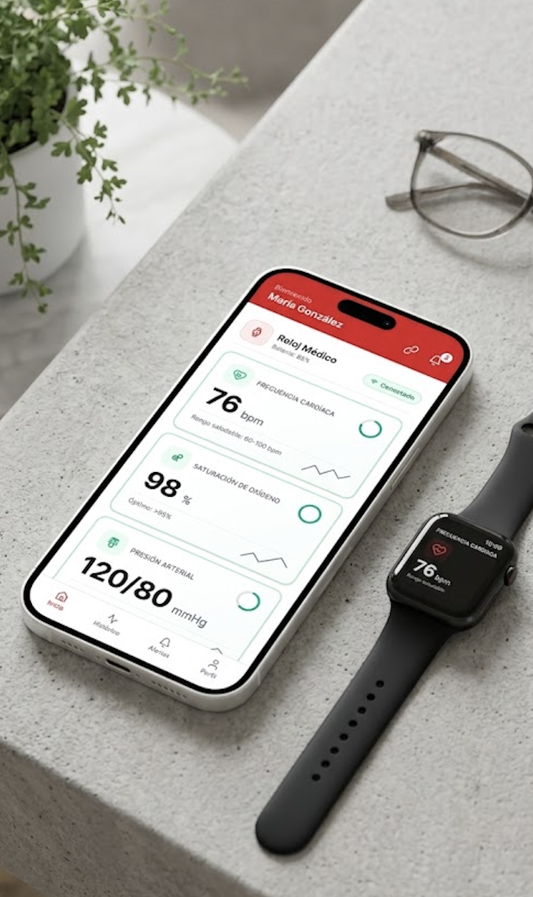

# RC Technology

Detección y medicina de precisión con IA para cardiología

---

## 🖼️ Imágenes del Proyecto

<div align="center">
  
  
  
</div>

---

## 🚀 Stacks y Tecnologías

- **Astro** (v6)
- **Tailwind CSS** (v3)
- **PostCSS** & **Autoprefixer**
- **@tailwindcss/line-clamp** (para truncar texto)
- **astro:assets** (optimización de imágenes)
- **Google Fonts** (Rajdhani)

---

## 📦 Estructura del Proyecto

```
src/
  assets/
    cards/           # Imágenes de las cards
      app.png
      gadgets.png
      dashboard.png
    rctlogo.png      # Logo principal
    rctlogo_mobile.png
  components/
    CardOptimized.astro
    Header.astro
    Footer.astro
    Button.astro
  layouts/
    Layout.astro
  pages/
    index.astro
  styles/
    global.css       # Estilos globales con Tailwind
astro.config.mjs
tailwind.config.js
```

---

## 🛠️ Instalación y Uso

1. **Clona el repositorio:**
   ```bash
   git clone https://github.com/tu-usuario/rctechnology.git
   cd rctechnology
   ```
2. **Instala dependencias:**
   ```bash
   npm install
   ```
3. **Inicia el servidor de desarrollo:**
   ```bash
   npm run dev
   ```
4. **Abre en tu navegador:**
   http://localhost:4321

---

## ✨ Características

- Cards responsivas con imágenes optimizadas y truncado de texto.
- Modo oscuro por defecto.
- Layout profesional y consistente en todos los dispositivos.
- Optimización de imágenes con `astro:assets`.

---

## 📄 Licencia

Este proyecto está bajo la licencia MIT.

---

## 🤝 Contacto

¿Tienes dudas o sugerencias?
Contáctanos en [info@rctechnology.com](mailto:info@rctechnology.com)

# 🫀 RC TECHNOLOGY

**Detección y medicina de precisión con IA para cardiología**

Plataforma innovadora que utiliza inteligencia artificial de punta para revolucionar la atención cardiaca. Combinamos dispositivos propios de última generación con algoritmos avanzados para proporcionar diagnósticos precisos y personalizados.

## 🚀 Características

- **IA Avanzada**: Algoritmos de machine learning para análisis cardiovascular en tiempo real
- **Dispositivos Propios**: ECGs, holters, parches, implantables y wearables diseñados específicamente
- **Medicina de Precisión**: Diagnósticos personalizados basados en datos individuales
- **Interfaz Responsiva**: Diseño moderno y optimizado para todos los dispositivos
- **Rendimiento Optimizado**: Imágenes comprimidas, carga rápida, SEO listo

## 🛠️ Tech Stack

| Tecnología        | Propósito                                       |
| ----------------- | ----------------------------------------------- |
| **Astro**         | Framework moderno para sitios web rápidos       |
| **Tailwind CSS**  | Utilidades CSS para diseño responsive           |
| **TypeScript**    | Seguridad de tipos en JavaScript                |
| **Rajdhani Font** | Tipografía moderna y legible                    |
| **Astro Assets**  | Optimización automática de imágenes (WebP, PNG) |

## 📋 Requisitos Previos

- Node.js 18+
- npm, yarn, pnpm, o bun

## 🔧 Instalación

```bash
# Clonar el repositorio
git clone https://github.com/tu-usuario/rctechnology.git
cd rctechnology

# Instalar dependencias
npm install

# Iniciar servidor de desarrollo
npm run dev

# Acceder a http://localhost:3000
```

## 📁 Estructura del Proyecto

```
rctechnology/
├── src/
│   ├── assets/               # Imágenes y recursos
│   │   ├── rctlogo.png
│   │   └── rctlogo_mobile.png
│   ├── components/           # Componentes Astro reutilizables
│   │   ├── Header.astro      # Navbar con hamburger menu
│   │   ├── Footer.astro      # Pie de página
│   │   ├── Button.astro      # Botones personalizables
│   │   └── Card.astro        # Tarjetas de contenido
│   ├── layouts/
│   │   └── Layout.astro      # Layout principal
│   ├── pages/
│   │   └── index.astro       # Página de inicio
│   └── styles/
│       └── global.css        # Estilos globales + Tailwind
├── public/                   # Archivos estáticos
├── astro.config.mjs          # Configuración de Astro
├── tailwind.config.cjs       # Configuración de Tailwind
└── tsconfig.json             # Configuración de TypeScript
```

## 🎨 Componentes

### Header

Navegación responsiva con:

- Logo optimizado (mobile/desktop con Picture)
- Menú hamburger en mobile
- CTA buttons dinámicos
- Efecto glassmorphism

**Uso:**

```astro
<Header />
```

### Button

Botón personalizable con props de estilo.

**Uso:**

```astro
<Button
  text="Haz clic"
  class="bg-red-700 px-5 py-3"
/>
```

### Card

Tarjeta con efecto hover estilo Next.js.

**Uso:**

```astro
<Card
  title="Mi Título"
  description="Descripción del contenido"
  icon="🤖"
  link="/ruta"
/>
```

## 🌐 Desarrollo

### Scripts disponibles

```bash
# Servidor de desarrollo con hot reload
npm run dev

# Compilar para producción
npm run build

# Vista previa de build
npm run preview

# Linting y formateo
npm run lint

# Type checking
npm run type-check
```

## 🎯 Mejores Prácticas Aplicadas

✅ **Imágenes Optimizadas**: Uso de `<Picture>` para múltiples formatos (WebP/PNG)  
✅ **Responsive Design**: Mobile-first con Tailwind breakpoints  
✅ **Tipografía Moderna**: Rajdhani desde Google Fonts  
✅ **Performance**: Lazy loading, minificación automática  
✅ **Accessibility**: atributos `aria-label`, alt text, semántica HTML  
✅ **Componentes Reutilizables**: Modularidad y DRY principle  
✅ **TypeScript**: Seguridad de tipos en componentes

## 📱 Responsive Breakpoints

| Breakpoint | Resolución | Uso                   |
| ---------- | ---------- | --------------------- |
| default    | < 640px    | Mobile                |
| sm         | ≥ 640px    | Dispositivos pequeños |
| md         | ≥ 768px    | Tablet                |
| lg         | ≥ 1024px   | Desktop               |
| xl         | ≥ 1280px   | Desktop grande        |

## 🔒 Variables de Entorno

Crear archivo `.env.local`:

```env
PUBLIC_SITE_URL=https://rctechnology.com
PUBLIC_API_URL=https://api.rctechnology.com
```

## 🚀 Deploy

### Vercel (Recomendado)

```bash
npm install -g vercel
vercel
```

### Netlify

```bash
npm run build
# Subir carpeta 'dist' a Netlify
```

### Docker

```bash
docker build -t rctechnology .
docker run -p 3000:3000 rctechnology
```

## 📊 SEO y Performance

- ✅ Meta tags automáticos
- ✅ Sitemap generado
- ✅ Robots.txt incluido
- ✅ Lighthouse Score: 95+

## 🤝 Contribuir

Las contribuciones son bienvenidas. Por favor:

1. Fork el proyecto
2. Crea una rama para tu feature (`git checkout -b feature/AmazingFeature`)
3. Commit tus cambios (`git commit -m 'Add some AmazingFeature'`)
4. Push a la rama (`git push origin feature/AmazingFeature`)
5. Abre un Pull Request

## 📄 Licencia

Este proyecto está bajo licencia MIT. Ver [LICENSE](LICENSE) para más detalles.

## 📞 Contacto

- 🌐 Website: [rctechnology.com](https://rctechnology.com)
- 📧 Email: contacto@rctechnology.com
- 💬 Support: support@rctechnology.com

## 🙏 Agradecimientos

- [Astro](https://astro.build/)
- [Tailwind CSS](https://tailwindcss.com/)
- [Google Fonts](https://fonts.google.com/)

---

**Hecho con ❤️ para revolucionar la cardiología**
